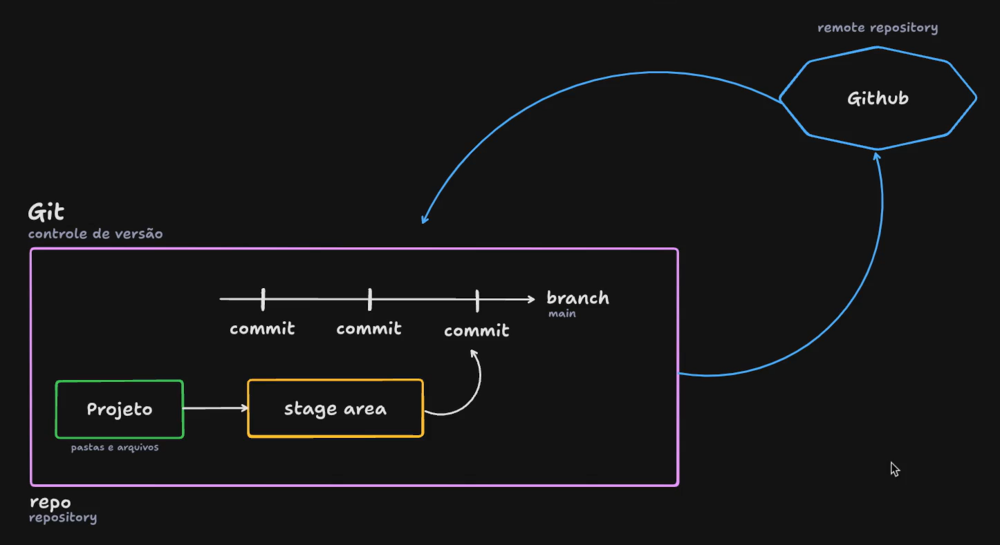

# GIT E GITHUB

## Git (Versionamento de arquivos)

### COMO FUNCIONA

Imagine que seu codigo tenha uma linha do tempo, e que nessa linha do tempo, existem pontos na história que podem ser visitados novamente.

O Git faz exatamente isto, ele serve para criar versões dos seus código para que possam ser requisitados. Você pode recuperar arquivos excluido existente em outras versões, você pode recuperar codigo etc.

### Terminologia
- A linha do tempo chamamos de _`branch`_, em que a linha principal se chama _`main`_.
    - Podemos criar diversas linhas do tempo (_branchs_) e se precisamos podemos adicionar essa linha do rempo alternativa na principal
- Cada ponto na linha do tempo é chamado de _`commit`_.
    - Antes de criamos um commit passamos por uma etapa chamada _`stage area`_, que é o processo através de comandos que "avisa" o git que aquele arquivo, aquele diretório está ponto para criar-se um versão.
- Porém tudo isto deve estar dentro de um ambiente que chamamos de _`repository`_ (repostório).
- O repositório é a aplicação do Git no seu projeto, porém, o Git só cria um repositorio local na sua maquina, devemos aplicar uma maior segurança e para isso utilizamos do _`GitHub`_ para realizar o armazenamento em nuvem do seu repositório. E além disso podemos fazer o sincronismo entre a nuvem e o seu _`local repo_`, para aplicar alterações de seus colegas que também tem acesso a este _`remote repo`_



### Instalação

- Windows:
    - basta acessar o [link](https://git-scm.com/downloads) e seguir com next até finalizar
    - Configuração: abra o _`Git Bash`_ e execute o seguinte comando":
    ```bash example-good
        git config --global user.name "username"
        git config --global user.email "email@dominio.com"
    ```
- Linux
    - basta executar o seguinte comando no terminal `apt-get install git` 
    - Configuração: no próprio terminal execute o seguinte comando:
    ```bash example-good
        git config --global user.name "username"
        git config --global user.email "email@dominio.com"
    ```
### Comando uteis

- ***git init***: Inicia o repositório do seu projeto
- ***_git status_***: Detalha as alterações feitas no seu projeto
- ***git add .***: Adiciona todos os arquivos e pastas no _stage area_
    - É possivel fazer o add de 1 pasta inteira acessando ela
- ***git restore <file>***: Recupera o conteudo de um arquivo na _stage area_ que ainda não foi _commitado_
- ***git commit -m "mensagem"***: Cria e descreve um ponto na historia
- ***git log***: Histótico de commits do projeto
- ***git rm --cached <file>***: Remove pastas ou arquivos do _stage area_